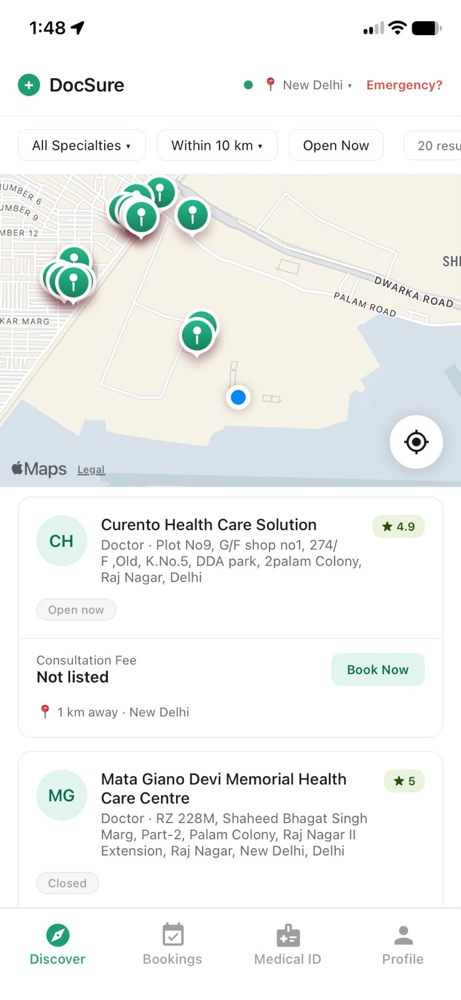
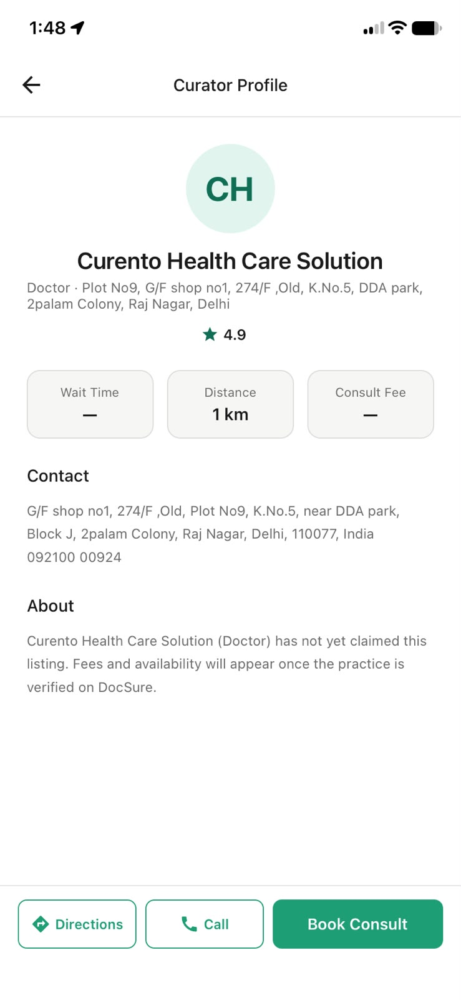
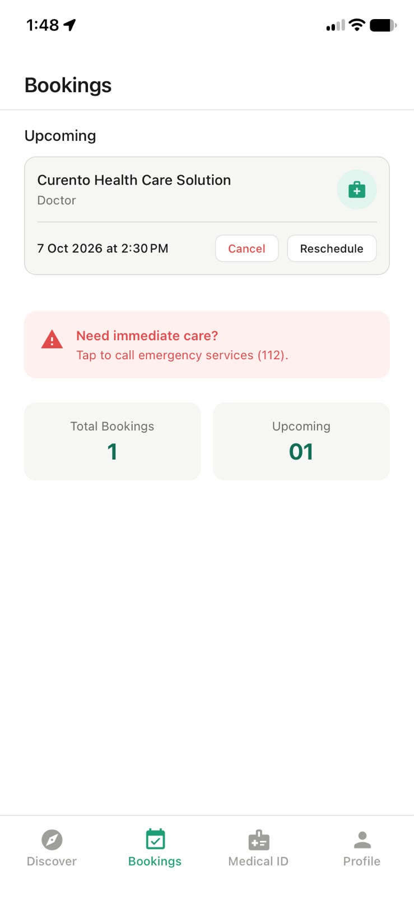
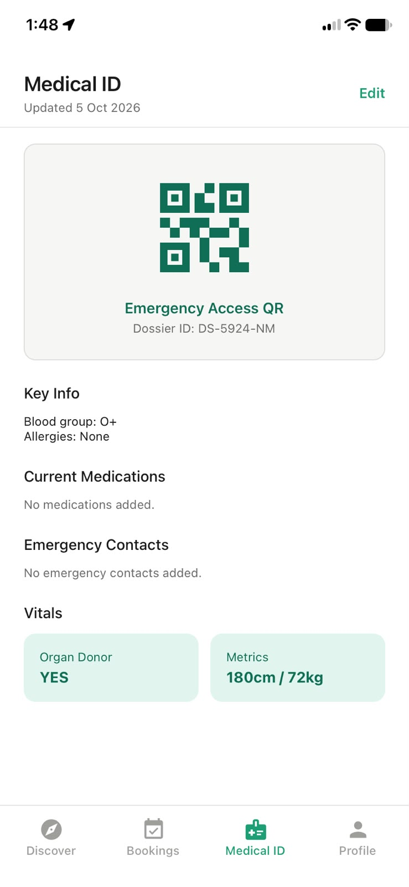
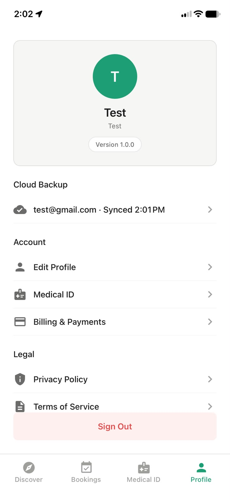

# DocSure

DocSure is a premium, location-aware doctor discovery mobile application built with React Native and Expo. It allows users to find trusted clinical curators nearby, view their transparent consultation fees, and manage medical appointments seamlessly.

## 📱 Screenshots

<p align="center">
  
  
  
  
  
</p>

## 🚀 Key Features

- **📍 Live Discovery & Google Places API**: Automatically detects user location via GPS and plots nearby verified doctors on an interactive map. Utilizes Google Places Autocomplete for lightning-fast address searching.
- **☁️ Cloud Sync & Supabase Auth**: Secure OTP login via Supabase. Features an offline-first architecture where data is cached locally and safely synced to the cloud when online.
- **🔍 Refine Search**: Premium animated bottom sheet for filtering doctors by specialty, language spoken, and availability.
- **👨‍⚕️ Detailed Profiles**: View doctor wait times, consultation fees, and verified status with a clean "Clinical Mint" aesthetic.
- **📅 Appointment Management**: Track upcoming and past bookings in a dedicated tab.
- **🪪 Medical ID**: Instant access to emergency medical information, current medications, and emergency contacts via a QR-enabled dossier.
- **✨ Custom Animated Splash**: Beautiful pulsing gradient splash screen for a premium first impression.
- **📱 Responsive & Notch-Aware**: Fully optimized for iOS and Android with proper safe area handling for notches and gesture navigation.

## 🛠️ Tech Stack

- **Framework**: [Expo](https://expo.dev/) / [React Native](https://reactnative.dev/)
- **Backend/Auth**: [Supabase](https://supabase.com/)
- **Location & Data**: Google Places API (New), Nominatim, Expo Location
- **Language**: [TypeScript](https://www.typescriptlang.org/)
- **Navigation**: [React Navigation 7](https://reactnavigation.org/) (Bottom Tabs & Native Stack)
- **State Management**: [Zustand](https://github.com/pmndrs/zustand)
- **Maps**: [React Native Maps](https://github.com/react-native-maps/react-native-maps)
- **Icons**: [Expo Vector Icons](https://docs.expo.dev/guides/icons/) (Material Design)

## 🎨 Design System: "Clinical Mint"

The app follows a custom design language focusing on clarity, trust, and professionalism:
- **Color Palette**: Harmonious Mint-based primary colors with deep charcoal text.
- **Typography**: Inter/Roboto hierarchy for maximum readability.
- **Aesthetics**: Modern card-based layouts, glassmorphism-inspired overlays, and smooth micro-animations.

## 🏁 Getting Started

### Prerequisites

- Node.js (Latest LTS)
- Expo Go app on your mobile device (or an emulator)
- Supabase Account (for Auth and Database)
- Google Cloud Account (for Places API)

### Installation

1. Clone the repository:
   ```bash
   git clone https://github.com/Himanshu1281/DocSure.git
   ```
2. Install dependencies:
   ```bash
   npm install
   ```
3. Set up environment variables:
   Create a `.env` file based on `.env.example` and add your Google Places API Key and Supabase credentials.
4. Start the development server:
   ```bash
   npm start
   ```
5. Scan the QR code with your mobile device or press `i`/`a` to open in an iOS/Android emulator.

## 🏗️ Architecture

The project follows a **Feature-First / Clean Architecture** pattern:
- `src/core`: Global configurations (navigation, theme, storage).
- `src/features`: Domain logic and UI components split by feature (Discovery, Bookings, Medical ID, Profile). Includes `domain/`, `data/`, and `presentation/` layers for strict separation of concerns.
- `src/shared`: Reusable hooks and base components.

---

Built with ❤️ by Himanshu
